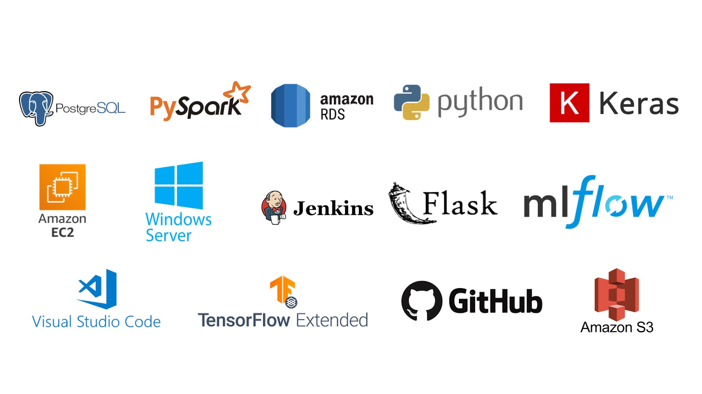
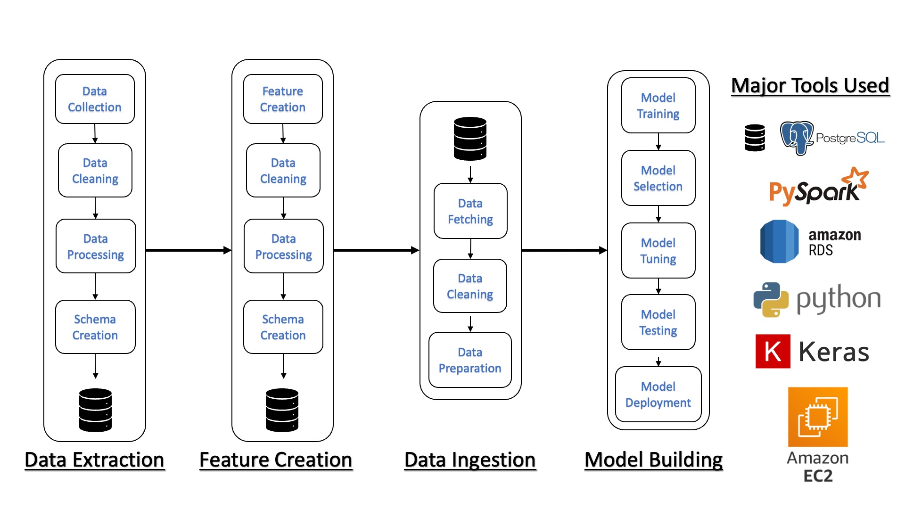
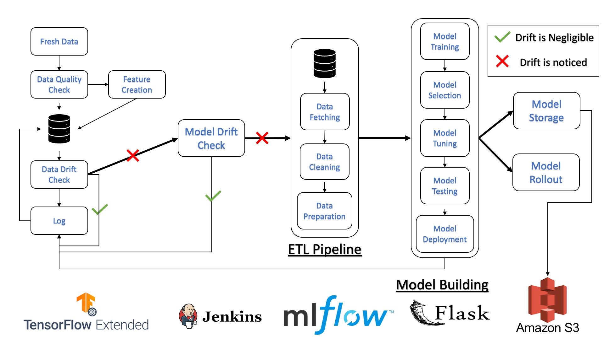

# Stock Return Prediction Project

## Overview

This project focuses on predicting the stock returns of major companies using advanced machine learning techniques and MLOps practices. The project harnesses the power of Python, PySpark, TensorFlow, Keras, and AWS services (EC2, S3, RDS) to develop and deploy models that predict future stock prices based on historical data. Our data is sourced from `yfinance` for stocks including Apple, Tesla, Microsoft (MSFT), NVIDIA, and Amazon (AMZN).

## Structure

The project is divided into two major parts: Initial Setup (Data Science) and MLOps (ML Engineering).

### Part 1: Initial Setup (Data Science)

#### Data Preparation
- Data is sourced from `yfinance` for Apple, Tesla, MSFT, NVIDIA, and AMZN.
- Quality checks and Exploratory Data Analysis (EDA) are performed.
- Data is cleaned and organized into tables for each ticker using PySpark, following the naming convention `<ticker>_daily_stock_data`. Columns include `open`, `close`, `high`, `low`, `volume`, `adj_close`, `created_at`, and `last_modified_at`.

#### Feature Engineering
- Feature tables are created for each ticker with technical indicators such as Moving Averages (MA), Exponential Moving Averages (EMA), Relative Strength Index (RSI), Moving Average Convergence Divergence (MACD), and Bollinger Bands.
- Features are computed using PySpark and stored in tables named `<ticker>_features`.

#### Model Development
- Data is ingested from tables and processed into a windowed dataset using TensorFlow and Keras.
- A variety of models, including linear regression, CNN, and LSTM, are explored using forward selection techniques.
- Model performance is evaluated, and the best model is selected.
- KerasTuner and MLflow are used for hyperparameter tuning and performance tracking.
- Model information is stored back into Postgres.

### Part 2: MLOps (ML Engineering)

#### Automation and Monitoring
- Scripts are created for data sourcing, ingestion, feature creation, data drift checks, model drift checks, new model training, model storage, and model deployment.
- Jenkins is used to automate these processes, ensuring models are trained and deployed only when necessary.
- Logging logic is implemented for monitoring and future analysis.

#### Deployment
- A Flask application is developed and hosted on an AWS EC2 instance, allowing public access.
- The application provides an interface for users to select one of the five tickers, displaying the past 60 days of data and predicting the next 5 days' values in a dashboard.
- Models are selected based on the chosen ticker, and predictions are made using the last 60 days of data.

#### Daily Operations
- Data sourcing and ingestion are scheduled to run daily in the morning before the market opens, ensuring up-to-date predictions.

## Technologies Used

- **Programming Languages:** Python
- **Frameworks and Libraries:** PySpark, TensorFlow, Keras, Flask
- **Databases:** PostgreSQL (hosted on AWS RDS)
- **Storage:** AWS S3
- **Compute:** AWS EC2 (Windows Server)
- **MLOps Tools:** Jenkins, MLflow, KerasTuner

## Getting Started

To get started with this project, you'll need to set up an AWS account and install the required Python packages. Detailed instructions on setting up the environment, sourcing data, and running the application are provided in the subsequent sections.

## Installation

1. Clone the repository to your local machine or AWS EC2 instance.
2. Install the required Python packages using `pip install -r requirements.txt`.
3. Follow the setup instructions for AWS services (EC2, S3, RDS) as detailed in the AWS documentation.
